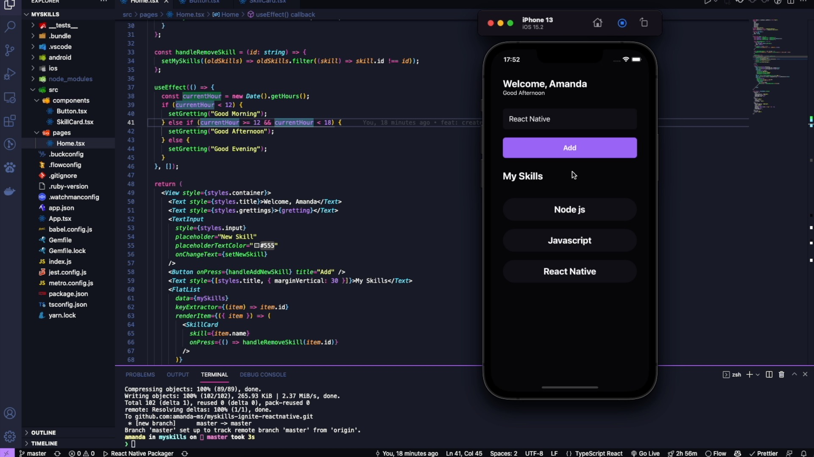

<h1>MySkills</h1>
 

<h3>Tecnologias</h3>
<ul>
  <li>React Native</li>
  <li>Typescript</li>
</ul>

 

App em React Native usando os conceitos de estado, propriedade, imutabilidade, hooks, estilização e utilizaçao do Typescript.

 

